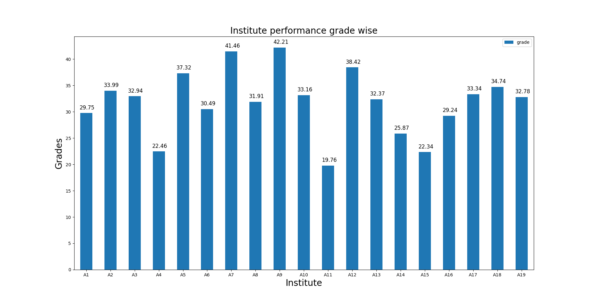
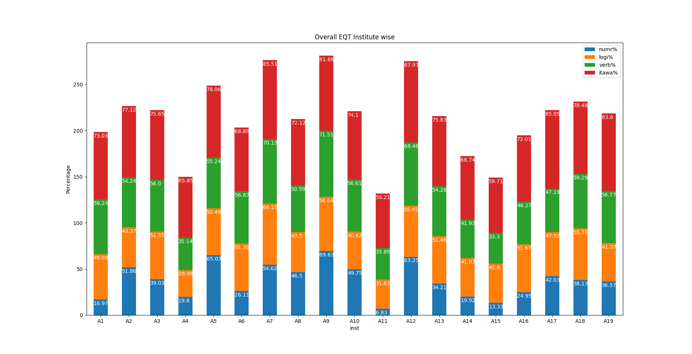
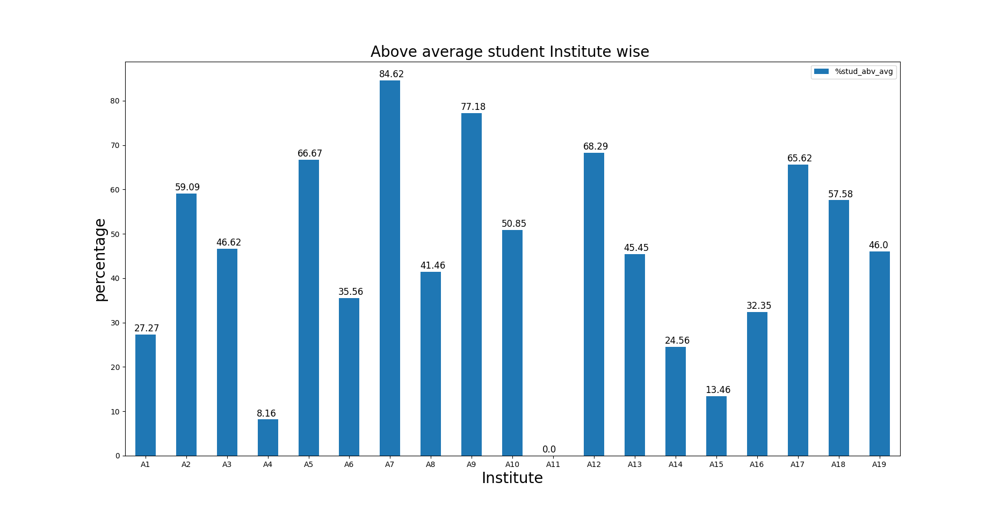
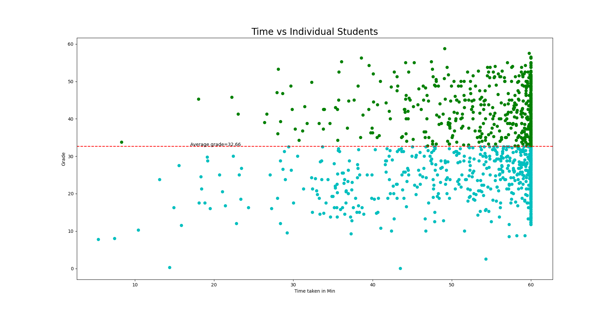

Employability Quotient Test (EQT) is a unique offering of ICT Academy of Kerala to it's Premium Member Colleges. EQT assesses the students' 1) Numerical 2) Logical 3) Verbal and 4) IT Awareness skills.

The test description is as follows:
EQT consists of 15 questions each from the following categories:
Numerical Ability
Verbal Ability
Logical Reasoning
IT Awareness
Total Questions - 60     
Time - 60 minutes
Marks - 60
There will be negative marking for wrong answers; one-fourth mark will be deducted for a wrong answer.

Expectations
----------------
1. Merge the files and create a single one (given 19 files of 19 institutions)
2. Apply Data Cleansing activities
3. Perform any useful exploratory analytics and share results: 
     (Can be, but not necessarily)
	a)Skill Analysis (To identify gaps in the candidates' skill on each category - overall)
	b)Skill Analysis (To identify gaps in the candidates' skill on each category – institution wise)
	c)Any Percentile based comparison
	d)Skill Comparison (Institution Vs Overall)
---------------
Submissions
---------------
1. Processed Dataset
2. Results of Analysis (Can be plots, Tables, etc.)

Excel files availbale at EQT Results folder

					Anomalies and Data Cleaning
• From excel files of 19 institutes, we observe that only 1326 students submit the exam
out of 1337.So we consider only 1326 student for analysis.
• All the institutes a have neagtive mark of ‘-0.25’ for the wrong attempts,’1.00’ for the
correct attempts and ‘-’ for not attempting questions,but the institute A12 didn’t
given any negative marks for wrong answer and it filled by ’0.00’ instead of ‘-0.25’.So
here we replace the ‘0.00’ as ‘–0.25’.
• It is notified that exam is for 1 hour,From files we have few students who exceed the
maximum time of 1 hour(60 min) and was replaced as 1 hour for all.
• From q1 to q60,we can’t anlayse it,because we don’t know how the question was
displayed in dashboards of the individual students as a random or sequence and we
cannot consider the particular one as numerical,logical,verbal respectively.So here we
taken the percentage of logical,numerical,verbal and IT awareness as it is from the
file given.

			      	      Institutes Overall Grade on EQT
• The below plot depicts the overall grade on EQT by institutes level.Here A9 institute performed well followed by
A7,A12 and A5 respectively and the least performed by A11 institute and followed by A15 and A4 in low grade .
• Although the performance of A7 is comparable with A9, it should be noted that the number of studens in these
institutes are 13 against 149 in A9. So the acheivement of institute A9 is remarkable.
• There was 11 institutes (A2,A3,A5,A7,A9,A10,A12,A13,A17,A18,A19) performed above average grade out of 19
institutes.

				     Performance on EQT Institute-wise
• The below stacked bar chart depicts the EQT on numerical,logical,verbal,IT awareness percentages of different
institutes.
• From the plot we came to know that numerical type was worst performed by the students followed by logical and
verbal.
• The students are good at IT awareness were most of the institutes performed well.

				     Percentage of above average students
Institute wise
• From the figure it can be seen that institute A7 has 84.62% of students who are above average
followed by A9 which has 77.18% also institutes A2,A5,A12,A10,A12,A17,A18 who has more than
50% of students scored above above average.

				     Time taken by individual students for EQT

The plot shows the time taken by the students in all institutes to submit the EQT exam. The red line
divides the data points into marks scored above and below average.The green points represents the
students scored above average and cyan indicates below average.From the plot most of the above
average students taken 50 to 60 minutes to complete.

